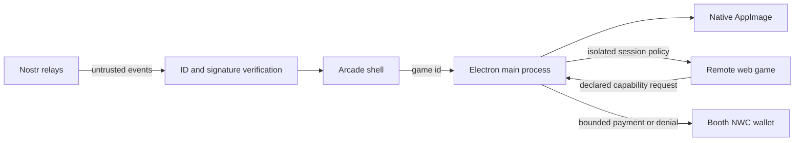

# gamestr arcade

A controller-first Electron arcade cabinet for native AppImages and isolated web
games. It combines a cinematic game selector, live verified Nostr leaderboards,
offline/local game support, and operator-friendly booth controls.

## Highlights

- Keyboard and multi-gamepad navigation, including a virtual cursor for web games
- Versioned game manifests with readiness, controls, network and capability declarations
- A player-facing **Ready to Play** check before every launch
- Native AppImage launch with a playable web fallback when the binary is absent
- Session-wide, bounded Nostr score feeds with event ID and signature verification
- Live profiles, Today / All-Time boards, relay controls and local cache support
- Themeable brand, accent, CRT and attract-mode presentation
- Linux AppImage packaging and repeatable Node 22 CI quality gates

## Quick start

```bash
npm ci
ARCADE_KIOSK=0 npm run dev
```

For a browser-only design preview:

```bash
npm run preview:web
```

## Trust boundaries



The manifest declares what a web game would like to use; it does not grant that
access. The Electron main process is authoritative. Relay payloads are treated as
untrusted until their event ID, Schnorr signature, schema and game tags pass.

## Add a game

Create `games/<slug>/game.json`. Manifest v2 is documented in
[SETUP.md](./SETUP.md#gamejson-fields) and machine-validated by
[`schemas/game-manifest-v2.schema.json`](./schemas/game-manifest-v2.schema.json).
Legacy manifests remain supported.

## Quality gates

```bash
npm run typecheck
npm run validate
npm test
npm run build
npm audit --audit-level=high
npm run dist       # Linux AppImage
```

See [SETUP.md](./SETUP.md) for the booth runbook and
[`games/README.md`](./games/README.md) for the catalogue contract.
